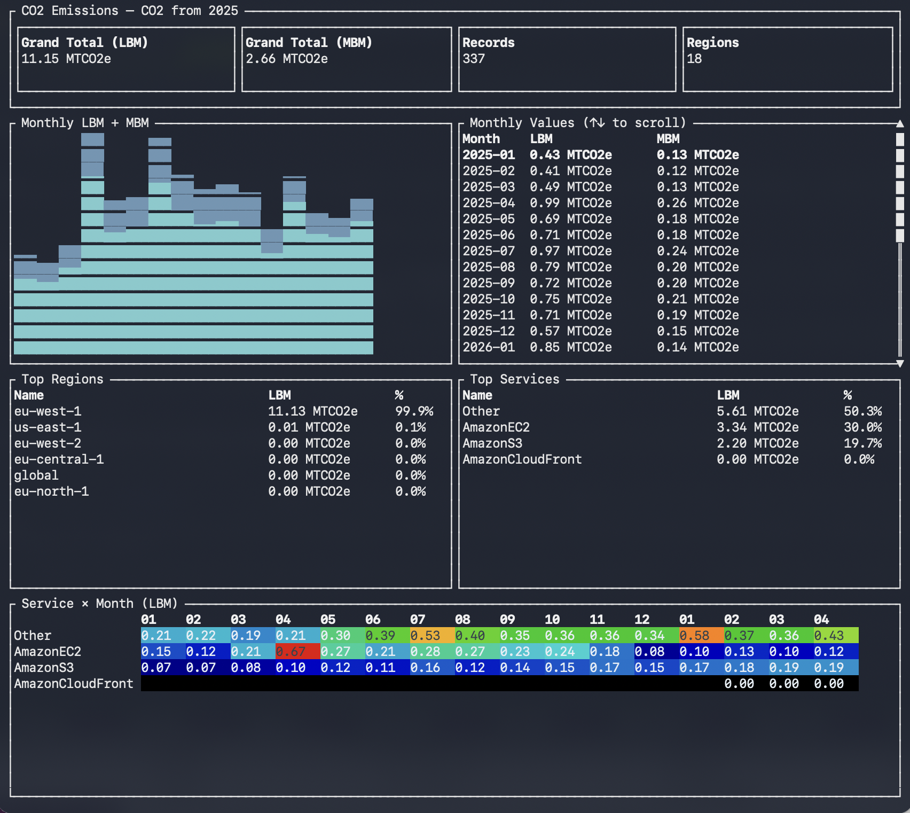

# co2

[](https://github.com/justjoheinz/co2/actions/workflows/ci.yml)

Interactive terminal UI for AWS Carbon Footprint data.

Queries the [AWS Sustainability API](https://docs.aws.amazon.com/aws-cost-management/latest/APIReference/API_sustainability_GetEstimatedCarbonEmissions.html) and displays monthly emissions broken down by region and service, with a stacked bar chart, ranked tables, and a service × month heatmap.



## Usage

```
co2 --profile <profile> --from <YYYY[-MM]> [--to <YYYY[-MM]>] [--title <text>]
co2 --data <file.json> [--title <text>]
```

### Live query

```sh
# Full year
co2 --profile myprofile --from 2024

# Date range
co2 --profile myprofile --from 2024-06 --to 2025-03

# Custom title
co2 --profile myprofile --from 2024 --title "Production"
```

`--from` is required. `--to` defaults to the current month. Both accept `YYYY` (expands to Jan/Dec respectively) or `YYYY-MM`.

`--profile` falls back to `$AWS_PROFILE` if not specified.

The Sustainability API is only available in `us-east-1`; the tool targets that region automatically.

### From file

```sh
co2 --data results.json
```

Accepts the raw JSON output of:

```sh
aws sustainability get-estimated-carbon-emissions \
  --region us-east-1 \
  --granularity MONTHLY \
  --group-by REGION SERVICE \
  --time-period Start=YYYY-MM-DD,End=YYYY-MM-DD
```

`--profile`, `--from`, and `--to` are forbidden when `--data` is used.

### Options

| Option | Description |
|--------|-------------|
| `-p, --profile <PROFILE>` | AWS profile name from `~/.aws/config`; falls back to `$AWS_PROFILE` |
| `--from <YYYY[-MM]>` | Start of query range (required for live queries) |
| `--to <YYYY[-MM]>` | End of query range, inclusive; defaults to current month |
| `--data <FILE>` | Read emissions JSON from a file instead of querying AWS |
| `--title <TEXT>` | Override the title displayed in the TUI |
| `-V, --version` | Print version |

## Keybindings

| Key | Action |
|-----|--------|
| `q` / `Esc` | Quit |
| `↑` / `k` | Scroll up |
| `↓` / `j` | Scroll down |
| `PgUp` / `PgDn` | Scroll by 10 |

## Building

Requires [Rust](https://rustup.rs).

```sh
cargo build --release
```

The binary is written to `target/release/co2`.

To install the binary into `~/.cargo/bin`:

```sh
cargo install --path . --locked
```

`--locked` is required to use the pinned dependency versions from `Cargo.lock` and avoid coherence errors from fresh dependency resolution.

Requires an AWS profile with permissions for `sustainability:GetEstimatedCarbonEmissions`.
